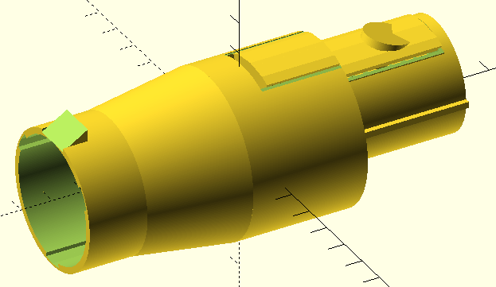
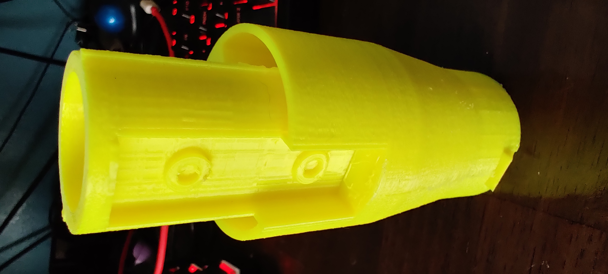
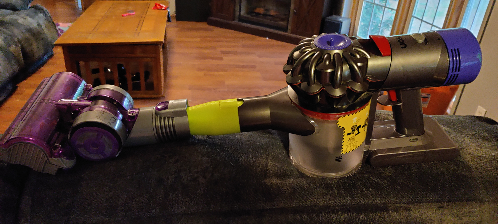

# Dyson Vacuum Accessory Adapter

Our family originally had a Dyson DC14 Animal vacuum cleaner, which worked well until it eventually died.  We then got a
DC8+ Animal, which we like quite a bit, but still had all the old accessories.  My wife then asked me if I could design
and print an adapter to use the old accessories with the new vacuum.  This is that adapter.  

# The Adapter

The adapter is designed in three pieces, so that the connection to the older accessory could be printed and tested
independently from the connection to the newer vacuum.  This also has the side effect of potentially allowing a bit of a
mix-and-match approach with the connectors.

# Printing

Printing hasn't been too difficult, I'm using PLA around 50% infill with supports on to give some rigidity while still
keeping print speed reasonable.  

I've been printing with the dc8 connector on top and the dc14 connector on the plate. Once the part comes off the
printer, it doesn't take too much prep work to get it to fit inside the vacuum.  A bit of filing and cleaning up
supports is about it.  Separating the button from the part is a bit delicate, as it tends to snap in half, but as
mentioned below this hasn't been a big deal for me.  If it does come apart in one piece, there are two holes underneath
it where a pen spring can be glued in to give the button some spring.  When it works, it seems to work pretty well.  For
my slicer:
* Clean up the supports in the gap between the end of the button and the main body.
* Gently pry up the sides of the button until it separates.
 
# Known Issues

The biggest issue is the button on the dc8 connector, it's hard to get the button to work properly - so it's a work in
progress.  I've found that friction tends to keep the adapter in the vacuum well enough for our use so I tend to just
rip it off if it gives me problems, but eventually a better solution needs to be found.

It does tend to snap if it gets twisted too hard, so it is a bit delicate.  I have had it snap inside the vacuum a few
times, but a pair of pliers gets things out easily.

# Files

In the `src` folder is a set of subfolders for the two vacuums that I'm currently working with.  The adapter in the
middle is in the `adapter` folder.

All of the source models are in the OpenSCAD format.

The `stl` folder contains the STL files that are used for printing.